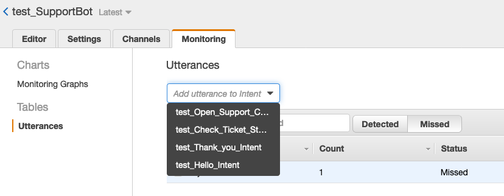
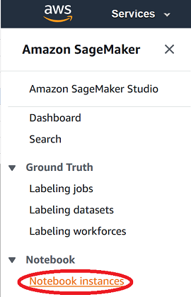
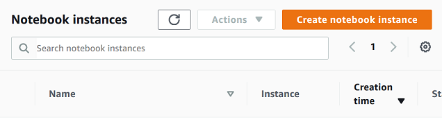
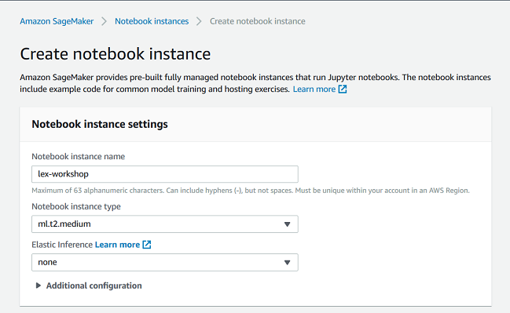
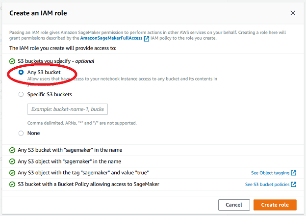
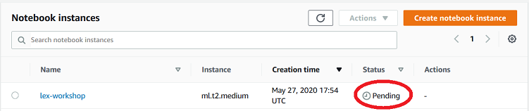
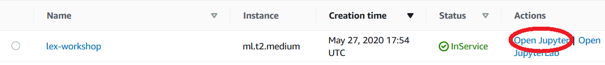
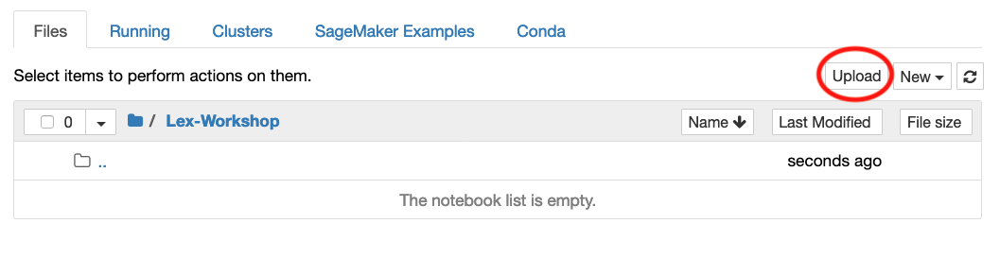
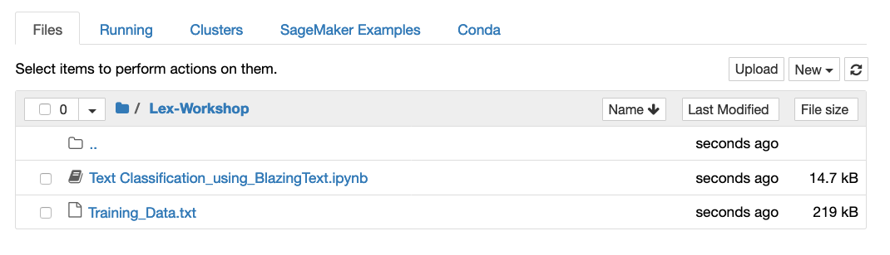
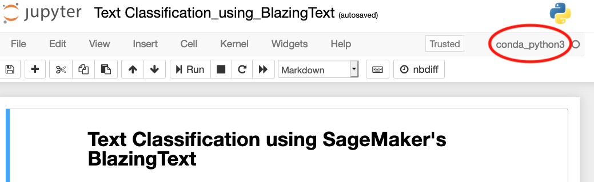

# Build Text Classification Model for Utterance Management using Amazon SageMaker

In this module, you will learn how to train a predictive machine learning model, and deploy it as a Amazon SageMaker endpoint. Please know the purpose of the workshop is to teach how to leverage basic Amazon Lex capabilities to build a chatbot, and the focus is not on teaching how to build a machine learning model. If you would like more step by step instructions on how to build a custom machine learning model using SageMaker, please prefer to other hands-on labs such as [Amazon SageMaker Workshop](https://sagemaker-workshop.com/). 

Having said that using a machine learning model to handle missed utterances automallically is a good use case for the fallback intent. In this way, you don't need to go to Lex console to manually add missed untterances to an intent. The following is the screenshot of where you can assign missed utterances to an intent. 

Normally you will select missed utterances and add it to an intent manually by choosing from the dropdown list.

## Create Amazon SageMaker Notebook Isntance

If you know how to start a SageMaker notebook instance, or have a jupyter environment with aws account access configured, you can move ahead to the next section to upload the notebook provided in this repo, and then start working on building the intent prediction model. 

If you would like a walkthrough on creating a notebook instance, please click on the following dropdown arrow to expand the section. 
 

<strong>Instructions on how to create a SageMaker notebook instance (expand for details)</strong>

1. Go to SageMaker console. Click on **Notebook instances** on the navigation bar.

    

    Then, click on **Create notebook instance** orange colored button on the upper right.    

    

    It will bring up the following window. Enter **lex-workshop** as the notebook instance name and choose default values for the rest.

    

    For the **Permissions and encryption**, choose *Create a new role* from the **IAM role** dropdown list. It will bring up the following window. CHoose *Any S3 bucket* option and click on **Create role** orange button. 

    

    After the IAM role being created, it will bring back to the *Create notebook instance* page. Leave rest of the settings as default and click on **Create notebook instance** orange button on the bottom of the page. 

    You will see status *Pending* as shown in the following screenshot. It would take about 5 to 10 minutes to provision the underlying compute instance and install necessary resources to create an environment for the notebook instance to be ready. 

    

    Once it is ready for use, the status shows **InService**. Then click on the **Open Jupyter** link

    

## Build your Text Classification Model on the Notebook Instance

Once you are in the notebook instance, upload the contents of **notebook** folder, which are *Text Classification_using_BlazingText.ipynb* and *Training_Data.txt* by using **upload** button on the upper right. 

Once uploaded, it will look like the following screenshot. 

Open the 'Text Classification_using_BlazingTest.ipynb' file, making sure conda_python3 is selected for the kernel. Then read documentation of the notebook, and execute each cell except the last one. The last cell deletes the model endpoint and is meant for cleanup after you go through all the workshop content. (Please note also that if you don't plan to complete the entire workshop and will not use the endpoint for the subsequent module, go ahead delete the endpoint as it incurs costs) 

The model endpoint deployed by executing the notebook will be used to predict which intent the missed utterance belongs; in this case, *Check_Ticket_Status* or *Open_Support_Case* intents. When the possible intent was identified, the Fallback Intent Lambda function will add the missed utterance to the predicted intent. The effect is when the same utterance is entered or spoken by the user in the future, the "right" intent will be invoked if the model predicted the intent correctly. 

Also when model has low confidence on its prediction, we determine that the utterance is neither for Check_Ticket_Status nor *Open_Support_Case* intents. It will just ignore the missed utterance and have Lex return "I am not able to understand" phrase. The threshhold for this decision point is customizable as Lambda's envrionment variable. As a dafault, it is set as 0.51 but if it is too high, you can lower this value. The value has to be between 0 and 1 as what the regression model returns is a cotinuous value between o and 1. Closer the 1, more confident it is for the intent it predicted.

Go to [**Module 4: Complete and Test Amazon Lex SupportBot**](../Module%204%20Complete%20Lex%20SupportBot%20and%20Test/README.md)  