# Complete and Test Amazon Lex SupportBot

## Update Lex SupportBot

In this section, you will be updating Lex chatbot to complete the chatbot configuration. 

1. First, go to the Lex console. Then look for *Check_Ticket_Status* intent and select it. 

    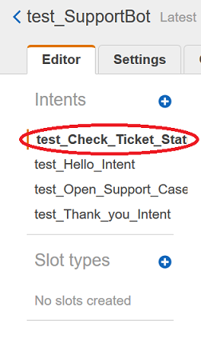

1. Under the **Lambda initialization and validation**, click on the highlighted checkbox. Then choose *SupportBotStarter-CheckTicketStatusValidationLambd-xxxxxx* from the dropdown list. 

    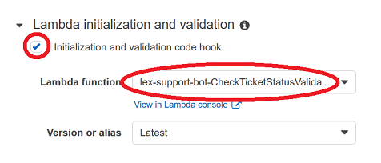

1. Scroll down to **Fullfillment** and make sure *SupportBotStarter-CheckTicketStatusLambda-xxxxxx* is selected. 

    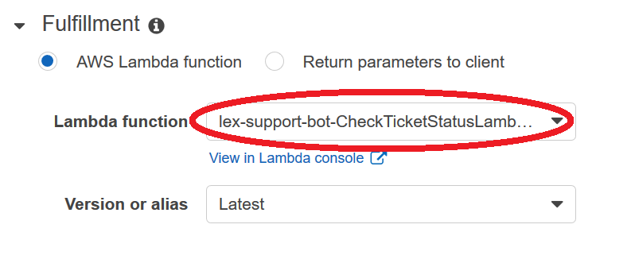

1. Next, go to *Thank_you_Intent*, and make sure is *SupportBotStarter-ThankYouIntentLambda-xxxxxx* is selected under **Fulfillment**. 

What we have done here is wire the Lambda functions to the Intents that the user is directed to. Intents are the blocks of functionality that contain things like Sample Utterances and are run when a user says a Sample Utterance inside them that activates them. Intents can be handled by Lambda functions, or simple just return a message back to the user with no special action.

## Add Fallback Intent to SupportBot

In this section, you will be configuring the Fallback intent and error handling. Fallback intent will invoke a Lambda function that leverages the SageMaker model to find the intent of the missed untterance. 

### Configure Fallback Intent

1. Go back to the Lambda console and find *SupportBotStarter-FallbackIntentLambda-xxxxxx* function. We will be creating an [environment variable](https://docs.aws.amazon.com/lambda/latest/dg/configuration-envvars.html) and save the SageMaker model endpoint name there. The endpoint name would look like the following and can be found on the SageMaker console. 

    ```
    blazingtext-2020-06-05-21-28-03-257
    ```
1. Make sure to write the endpoint name down.

    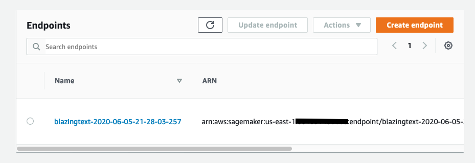


1. Then go down to **Environment Variables** on the Lambda console. Click on the **Edit** button on the upper right corner. 

    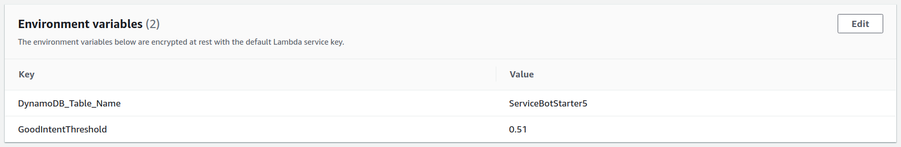

    It will bring up a view where you can add new envrionment variable. Click **Add environment variable** button. 

    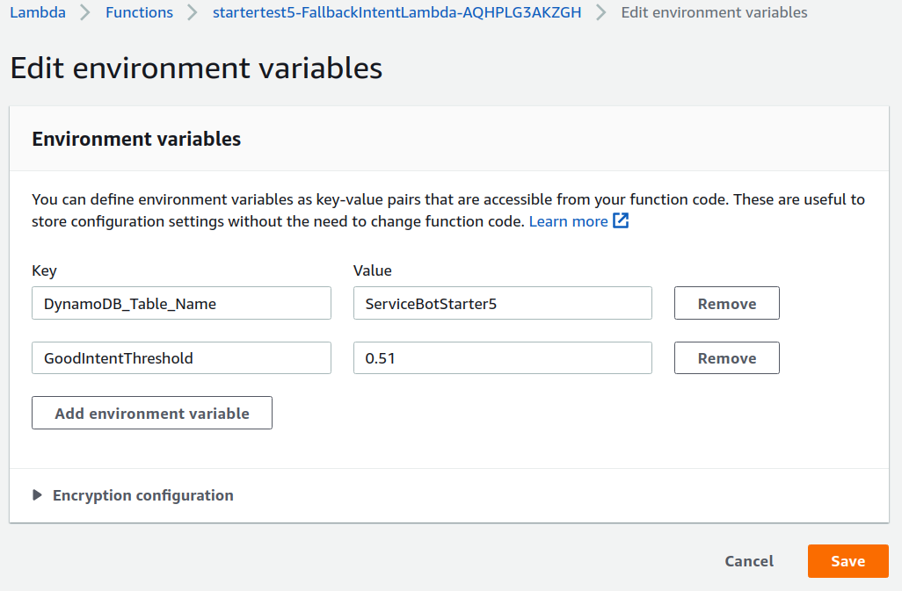

    For **Key**, enter *Sagemaker_endpoint_name*. For **Value**, enter the sagemaker endpoint name from the previous step.

    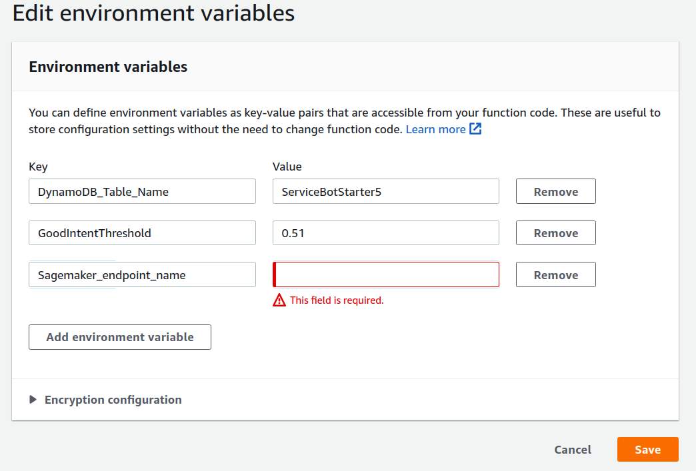

1. The next step is to tell our Lex Bot to use FallbackIntent:

    - In the console go to Amazon Lex -> Bots -> YourBot -> 

    - Go to 'Add Intent +'

    - Select 'Search Existing'

    - Enter 'AMAZON.FallbackIntent'

        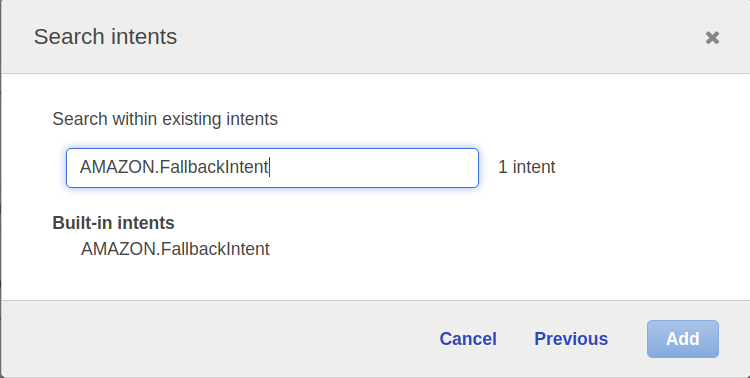

    - Click Add

    - Give the name of your 'prefix_FallbackIntent' i.e. 'starttest5_FallbackIntent'


1. Now we need to associate our Lambda function to the FallbackIntent.

    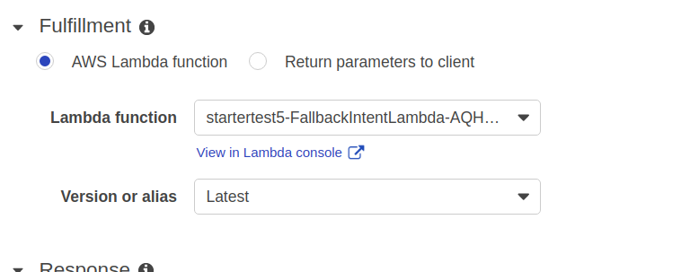

    - Click OK on any prompts for permissions.

    - Click 'Save Intent'.

### Configure Error Handling

Now one last step. We need to turn off clarification prompts, because our Fallback Intent Lamba function is going to handle that. If want to use your own AMAZON.FallbackIntent, you must disable these prompts.

1. Go to Editor -> Error Handling

    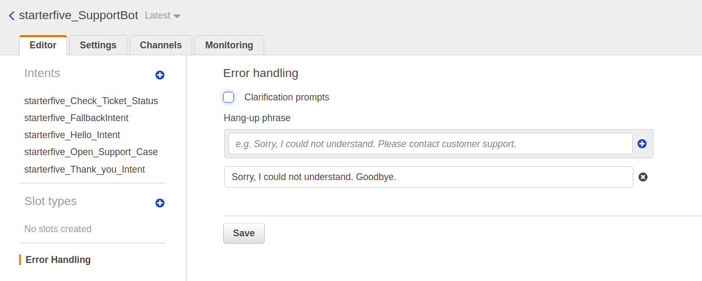

1. Uncheck 'Enable clarification prompts' and click 'Save'

1. Finally build the chatbot using the **Build** button on upper right on the console. 

    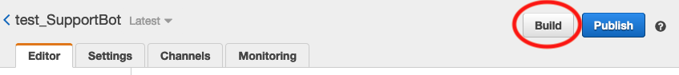

    When the built completes, it is ready for testing on the Lex console. The subsequent section will walk you through how to test the chatbot. 

Once you are done testing, use the **Publish** button to publish the SupportBot.

# Test your SupportBot

##  Test from Lex Console

In this section, you will be testing SupportBot. After completing all of the prior sections, you are ready to test the chatbot. 

On the Lax console, build the chatbot by pressing **Build** button on upper right. After the build completes, open the test pane by clicking the **Test Chatbot**.

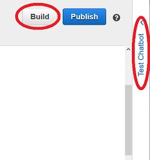

You will see **Test bot** pane where you can enter utterance like "Open a ticket" 

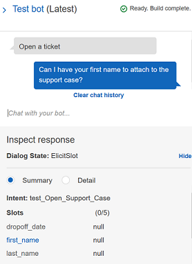

Complete the flow of creating a support ticket by providing the information the chatbot asks. Make sure to get to the **Dialog State** to be *Fulfilled*. This means the information was saved in the DynamoDB by calling the fulfillment Lambda function. 

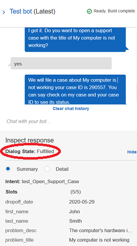

Next, type in "tell me the status of my ticket" and the case ID given by your chatbot as shown in the screenshot. (Do not use the same case ID shown in the screenshot)

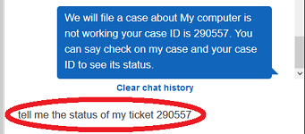

Then after the chatbot returned "We have found your support case...", enter "Thanks". It will reply with "Have a nice day" with the submitter's name. 

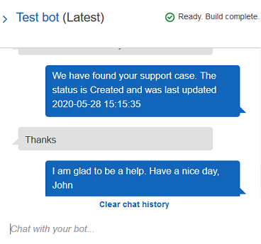


## Test your SupportBot from web application

In this section, you will be testing your web application.

Let's test out the Fallback Intent, so when Lex doesn't understand our request the following things will happen:

- Call SageMaker endpoint with text user entered
- receive back top intent back with score
- if the threshold is ABOVE or EQUAL to what we set in the Lambda's 'GoodIntentThreshold' Environment variable we will add the utterance to sample utterances for that intent and then direct the user back to that intent to continue
- if the threshold is BELOW the threshold, user will be prompted to try again later (Give up)

This uses Sagemaker endpoint to predict what the user is trying to say. The Lambda function for the FallbackIntent has a score environment variable set, you can adjust this higher or lower based on your preference. If the score is BELOW the threshold, it will tell the user it can't understand them (like normal). If the score is ABOVE the threshold, the user is directed to the highest likelyhood Intent they were trying to get to, and their text is added to the sample utterances to make it smarter in the future (without Sagemaker assistance).

:warning: * NOTE the code doesn't rebuild or redeploy your Bot - you will have to do that part yourself. If you have an existing window open with the sample utterances, you will need to refresh the page to see the new ones.

:warning: * NOTE you will have to click 'build' on your bot before you can test

Go to Cloudformation -> your stack -> outputs 

Open your browser to the cloudfront URL listed.

After that you should see this page:
 
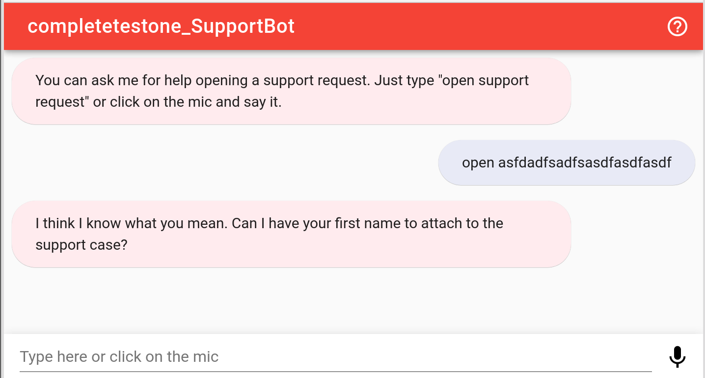


Let's try an example. Enter 'open somegobblywobblymess'. Then try 'check mygobblygoop'. If it continues going, it met the minimum threshold, otherwise it will tell you to try again later.

Congratulations! You are done with the lab.

Go to [**Main**](../README.md#conclusion) for final steps.