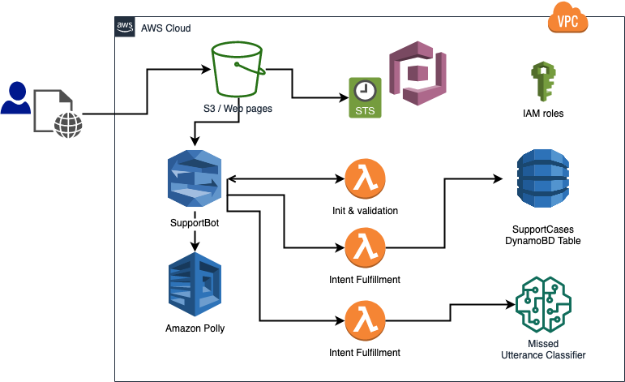
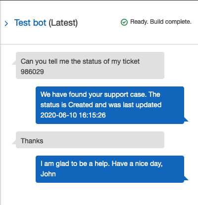

# Build a Support Bot using Amazon Lex and Amazon SageMaker

###### Created by Rumi Olsen (rumi@amazon.com) and Ryan Vanderwerf (ryvan@amazon.com)

## What is Amazon Lex?

[Amazon Lex](https://aws.amazon.com/lex/) is a service for building conversational interfaces into any application using voice and text. Amazon Lex provides the advanced deep learning functionalities of automatic speech recognition (ASR) for converting speech to text, and natural language understanding (NLU) to recognize the intent of the text, to enable you to build applications with highly engaging user experiences and lifelike conversational interactions. With Amazon Lex, the same deep learning technologies that power Amazon Alexa are now available to any developer, enabling you to quickly and easily build sophisticated, natural language, conversational bots (“chatbots”).

## Other AWS  Machine Learning Services That Will Come Up In This Workshop

[Amazon SageMaker](https://aws.amazon.com/sagemaker/) is a fully managed service that provides every developer and data scientist with the ability to build, train, and deploy machine learning (ML) models quickly. SageMaker removes the heavy lifting from each step of the machine learning process to make it easier to develop high quality models.

[Amazon Polly](https://aws.amazon.com/polly/) is a service that turns text into lifelike speech, allowing you to create applications that talk, and build entirely new categories of speech-enabled products. Polly's Text-to-Speech (TTS) service uses advanced deep learning technologies to synthesize natural sounding human speech. With dozens of lifelike voices across a broad set of languages, you can build speech-enabled applications that work in many different countries.

## What Lex SupportBot will do
In this workshop, you will build a Lex chatbot **SupportBot** that collects necessary information to open a support case. SupportBot will step through asking questions to gather information such as problem the user is facing, user's name, and date of drop-off. When the SupportBot receives all of the information, it persists the information into a DynamoDB table as a support case. The SupportBot also is capable of answering to the user about the case status give the case Id. 

Then you will deploy the SupportBot as a web application. 

## What you will learn
You will learn the following by completing this workshop. We will provide the sample support chatbot. You will be publishing and deploying it as a web application. Summary of what you will learn are:

- How to create initialization & validation Lambda function and use it in the Lex chatbot
- How to manage context between intents within the Lex chatbot
- How to manage missed utterances by using machine learning model trained in Amazon SageMaker and using Fallback intent 
- How to publish a Lex chatbot as a web application

## Prerequisites for the Workshop

- Sign up for an AWS account
- General knowledge on web application development
- General knowledge on Python programming 

## Workshop Roadmap

Before you begin the modules, run [AWS CloudFormation](https://aws.amazon.com/cloudformation/) template in the subsequent section. It will create an [Amazon Lex](https://aws.amazon.com/lex/) chatbot, a [Amazon S3](https://aws.amazon.com/s3/) bucket, [AWS IAM](https://aws.amazon.com/iam/) roles, and [AWS Lambda](https://aws.amazon.com/lambda/) functions. Then go through each of the modules in order. The following is summary of each module: 

- [**Module 1: Complete Web Application Deployment**](./Module%201%20Complete%20the%20Web%20Application%20Deployment/README.md). The CloudFormation template deploys the web application leveraging S3 bucket and [Amazon CloudFront](https://aws.amazon.com/cloudfront/). You will be updating the configuration file so that the web application will run the Lex chatbot built on your AWS account. 

- [**Module 2: Create AWS Lambda Functions for Validation and Intent Fulfillment**](./Module%202%20Create%20Lambda%20Functions/README.md). The following Lambda functions will be created by CloudFormation. Functions that you will fill in the code is in bold face. The sample code is provided but if you prefer, you are welcome to write your own code. The purpose here is to teach some key points described.  

    - Open Support Case Intent: Provided. No further action needed

    - Hello Intent: Provided. No further action needed

    - <b>Check Ticket Status Validation</b> : This Lambda function does simple validation for *ticket ID*. It checks to make sure the input is 6 digit number. It is a simple use case for initialization and validation Lambda to show how it works.

    - <b>Check Ticket Status</b> : This Lambda function is called when the intent is done eliciting the slot value and is ready for fulfillment. What it does is to look up the *ticket ID* for the case status. The purpose here, however, is to learn how to set up a session attribute. In this case, we create a session attribute called *submitterName*, and pass it between intents. The session attribute is used to manage context within a chatbot. 

    - <b>Thank You Intent</b> : This is called to fulfill Thank You Intent. This simple intent is invoked when the user say "Thank you" after fulfilling either of 2 major intents, *Check Ticket Status* and *Open Support Case*. The sample conversation between the chatbot and the user looks like the following:

        

        This sample conversation demonstrates how the session attributes value (which is the nameo of the person submitted the ticket) carried over to Thank you Intent.   

    - <b>Fallback Intent</b> : is called to fullfill Lex built-in [FallbackIntent](https://docs.aws.amazon.com/lex/latest/dg/built-in-intent-fallback.html). We will use this Lambda function to call a SageMaker model to help with the next course of action. You will build the model in module 3. 

- [**Module 3: Build Text Classification Model for Utterance Management using Amazon SageMaker**](./Module%203%20Build%20SageMaker%20Model). Notebook will walk you through step by step how to build the model that predicts which intent the utterance/user input would belong to. The model will be deployed as a SageMaker endpoint and it will be called from the Fallback Intent Lambda function. If the model has high confidence in its prediction, the utterance is added to the predicted intent. High confidence here is greater than 50% of chance the prediction is right. This value is configurable and can be made lower to avoid wrong utterances to be added to an intent. 

- [**Module 4: Complete and Test Amazon Lex SupportBot**](./Module%204%20Complete%20Lex%20SupportBot%20and%20Test/README.md). The final module will update SupportBot to make sure right Lambda is called at the right point. Then once that is complete and build the Lex, you are ready to test the Lex first from the Lex console. And then from the website you configured in the module 1. 

- [Conclusion](#conclusion)
- [Final Step](#final-step)

## Run CloudFormation Template

Please note Amazon Lex is supported in the following regions at the time of this writing. We continusouly add more regions for the service to be available. Please check the [Amazon Lex documentation](https://docs.aws.amazon.com/general/latest/gr/lex.html) for the most up to date information. 

The CloudFormation templates available will be limitted to those regions.

 - us-east-1
 - us-west-2
 - eu-west-1
 - eu-west-2
 - ap-southeast-1
 - ap-southeast-2
 - eu-central-1

Click the launch links below to load the starter Cloudformation template that creates all the components necessary for each modules. These are not complete, as walking through the instructions of each module will help you complete them. If you get stuck, and just want to start the whole project completely done, see the CloudFormation links under 'Complete' below these ones.

Region| Launch
------|-----
US East 1 (N. Virginia) | 
US West 2 (Oregon) | 
EU West 1 (Ireland) | 
EU West 2 (London) | 
EU Central 1 (Frankfurt) | 
AP Southeast 1 (Singapore) | 
AP Southeast 2 (Sydney) | 

Complete Cloudformation Template (If you get stuck)

Region| Launch
------|-----
US East 1 (N. Virginia) | 
US West 2 (Oregon) | 
EU West 1 (Ireland) | 
EU West 2 (London) | 
EU Central 1 (Frankfurt) | 
AP Southeast 1 (Singapore) | 
AP Southeast 2 (Sydney) | 

## Conclusion

What you learned in this workshop:

- How to create initialization & validation Lambda function and use it in the Lex chatbot
- How to manage context between intents within the Lex chatbot
- How to manage missed utterances by using machine learning model trained in Amazon SageMaker and using Fallback intent 
- How to publish a Lex chatbot as a web application

## Final Step

**Please do not forget**:
- To delete the CloudFormation template which deletes the objects provisioned by the template 
- To delete the SageMaker model endpoint from the console or by going back to the notebook and execute the last cell
- To stop the SageMaker notebook instance 

